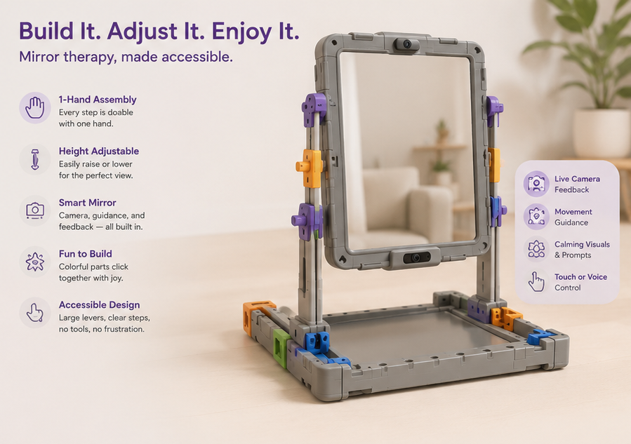
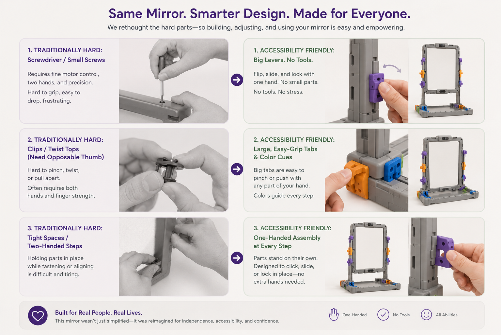

# 🪞 PeaceByPiece

> **IKEA meets occupational therapy** — a modular smart therapy mirror where building it *is* the rehabilitation.

---

## The Problem

Upper limb impairment affects hundreds of millions of people worldwide, yet mirror therapy still relies entirely on a passive tool. Smart AI mirrors exist — but their potential for integrated rehabilitation exercises remains largely untapped. And for users with limited dexterity or mobility, even assembling these devices can be an inaccessible barrier to care.

**The numbers behind the need:**

| Condition | Global | Canada |
|---|---|---|
| New strokes per year | 12 million | 108,000 |
| Living with post-stroke impairment | 94 million | 878,000 |
| Hand fractures per year | 18 million | — |
| Tendon injuries per year | 6–7 million | — |
| Children with Developmental Coordination Disorder | ~5–6% (underdiagnosed) | — |

---

## Our Solution

**PeaceByPeace** introduces an accessible, modular smart therapy mirror system designed for individuals with limited upper limb mobility or dexterity. The assembly process itself is the first rehabilitation exercise.



Each step is deliberately structured to encourage:

- 🤏 **Fine motor skill practice**
- 🖐️ **Dexterity development**
- 🔄 **Hand-eye coordination**
- 💪 **A sense of independence and accomplishment**

Rather than handing patients a pre-assembled device, the modular design invites them to participate in building their own therapeutic tool — with components sized, shaped, and sequenced for those with limited grip strength or precision.

---

## What Makes This Different

| Existing Approach | PeaceByPeace |
|---|---|
| Mirror therapy = passive tool only | Assembly process = active rehabilitation |
| Smart mirrors underutilize AI for exercises | AI integrated throughout the rehab workflow |
| Setup often requires clinician assistance | Designed for independent, accessible assembly |
| No therapeutic value before first use | Rehabilitation begins from step one |

---

## Who It's For

**Primary users:** Rehabilitation clinics and occupational therapists working with clients who have limited upper limb mobility or dexterity and would benefit from mirror therapy.

**End patients include those recovering from:**
- Stroke
- Hand fractures
- Tendon injuries
- Developmental Coordination Disorder (DCD)

---

## How It Works

The device ships as a set of modular components. Assembly is guided step-by-step, with each stage designed around a specific therapeutic goal — progressing in complexity as the user's session advances. Once assembled, the smart mirror continues rehabilitation through AI-guided mirror therapy exercises.

```
Unbox → Assemble (rehab step 1–N) → Use mirror → AI-guided exercises
```




*PeaceByPiece — because recovery starts before the first reflection.*
